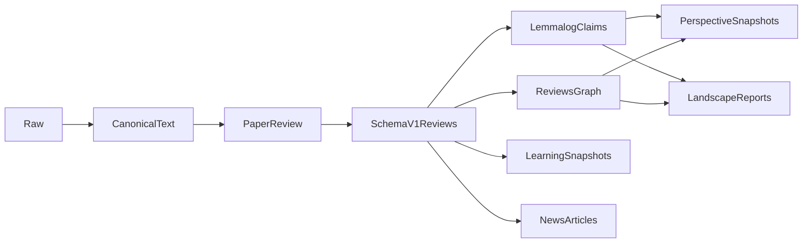

# Daily reads

Turn a paper corpus into reviewed evidence, then into dated learnings, perspectives, competitive research landscapes, and analytical news articles. Human review gates are deliberate: a person invokes each skill and reads the output before the next synthesis layer uses it.

## Layout

| Path | Role |
|------|------|
| `papers/raw/YYYY-MM-DD/` | Immutable dumps (PDF/HTML extracts). Do not edit. |
| `papers/canonical/YYYY-MM-DD/` | Repaired markdown, one folder per dump date mirroring `papers/raw/`. One file per paper. Graphify corpus. |
| `papers/index.md` | id, paths, status (`raw` / `canonical` / `reviewed`). |
| `reviews/` | One schema-v1 review per paper: `{id}.md` (no version in the filename). The downstream source of truth. |
| `learnings/` | Dated snapshots of reusable mechanisms and findings. |
| `perspectives/` | Dated, provisional arguments for internal research discussion. |
| `trends/` | Dated competitive research landscape reports for product/GTM/leads. |
| `news/` | One analytical article centered on one reviewed paper. |
| `context/` | Historical working material showing how earlier views evolved; not the output location for new synthesis. |
| `lemmalog/` | Claim schema and Datalog rules. |
| `papers/canonical/graphify-out/` | Concept graph of the **full papers**. Lives next to that corpus, not at the repo root. |
| `reviews/graphify-out/` | Optional later graph of **reviews only** (smaller, denser; can use a stronger model). |

## Paper ids

- arXiv: `arxiv:YYMM.NNNNN` — **no version in the id**. Version lives in canonical frontmatter.
- Canonical filename: `YYMM.NNNNN.md` under the dump date folder (example: `papers/canonical/2026-06-09/2606.18195.md`). One canonical file per id, in the folder of the dump that first brought it in.
- Other venues: `doi:…` or `slug:short-name`.

## Pipeline

1. Drop a dump into `papers/raw/YYYY-MM-DD/` and add a row to `papers/index.md` (`status: raw`).
2. Generate canonical Markdown with `scripts/arxiv_to_md.py` (below). Set `status: canonical`. Raw-only papers stay **off** the graphify corpus.
3. Explicitly invoke `paper-review` for one paper. It reads the full canonical text once and writes a schema-v1 review with dates, authors, organizations/support, facets, evidence, critical assessment, field context, internal relevance, and a **Claims** block.
4. Assert the paper's `reviewed_in` pointer and Claims to lemmalog when MCP/CLI is available. All other metadata stays in the review. Build/update the separate reviews graph after the review corpus is large enough to benefit.
5. Find cross-paper chains with `evidence-chains` (`two_hop`, then `lemmalog_why`). It reads reviews, not full papers.
6. Explicitly invoke `learning-synthesis`, `perspectives`, `trend-analysis`, or `news-article`. Each writes a new dated Markdown snapshot.



## The review boundary

`paper-review` is the only skill that opens `papers/canonical` or `papers/raw`. Its output is the durable interface for every later skill. If a synthesis cannot support a statement from the review, it records a review gap and asks for that paper to be reviewed again; it does not silently reopen the source.

Review frontmatter uses `schema_version: 1`. It preserves the earliest public date (with day/month/year precision), reviewed version/date, venue/status, authors, explicit organization roles, grants, released artifacts, compact facets, extraction limitations, and grounded critical flags. See `.agents/skills/paper-review/SCHEMA.md`. Validate reviews with:

```bash
uv run .agents/skills/paper-review/scripts/validate_review.py reviews/2605.26492.md
uv run .agents/skills/paper-review/scripts/validate_review.py
```

Downstream sources are `reviews/`, `papers/index.md` for coverage counts, lemmalog, prior dated snapshots, and `reviews/graphify-out/` when present. They do not use raw/canonical papers or the full-paper graph.

## Graphify

Each corpus has its **own** graph in `<corpus>/graphify-out/`. The CLI writes there by default when you pass that folder as the scan path. There is no repo-root `graphify-out/`.

| Corpus | Scan path | Graph | What it is for |
|--------|-----------|-------|----------------|
| Full papers | `papers/canonical` | `papers/canonical/graphify-out/` | Ingestion-time literature map and paper-review discovery |
| Reviews | `reviews` | `reviews/graphify-out/` | Downstream synthesis map of absorbed, critically assessed knowledge |

Never scan the **repo root**. Skills, scripts, and raw dumps would pollute the graph.

Graphify is the concept map (`query` / `path` / communities). It is **not** the evidence-chain store. Promote a review-graph path into lemmalog only when the Claims in those reviews support it; route full-paper candidates through `paper-review`.

Synthesis skills query the reviews graph only. They do not use the full-paper graph as evidence or reopen its source files. Build the reviews graph when there is enough reviewed material to make cross-review discovery useful (roughly 15–20 reviews is a reasonable first trigger).

Keep the graph, report, HTML, semantic cache, labels, and analysis in git so clones can query, open the map, and `--update` without re-paying for extraction. Ignore only machine-local paths (`.graphify_python`, `.graphify_root`), extract scratch, optional SVG/GraphML/Obsidian/wiki dumps, and dated snapshot folders (duplicates of `graph.json`).

### Install and credentials

```bash
uv tool install --upgrade 'graphifyy[bedrock]'   # Bedrock needs boto3 in Graphify’s env
```

Local secrets live in `credentials.sh` (gitignored). Source it in the shell before extract/query that needs a cloud backend:

```bash
source credentials.sh
```

Typical contents:

```bash
export AWS_REGION=us-east-1
export GRAPHIFY_BEDROCK_MODEL=global.anthropic.claude-haiku-4-5-20251001-v1:0
export OPENAI_API_KEY=sk-…          # optional; Graphify will prefer this unless --backend is set
export GRAPHIFY_OPENAI_MODEL=gpt-4.1-mini
```

Bedrock uses the AWS SSO session (`aws sso login`), not an Anthropic API key. `AWS_REGION` must be an **environment** variable (Graphify’s “no key” check does not read `~/.aws/config` alone).

**Always pass `--backend`.** If `OPENAI_API_KEY` is set, auto-detect picks OpenAI over Bedrock.

### First build (canonical papers)

```bash
source credentials.sh
aws sso login   # when the Bedrock session has expired
graphify extract papers/canonical --backend bedrock --directed
graphify cluster-only papers/canonical --backend bedrock
```

`--directed` keeps edge direction. `cluster-only` names communities and writes `GRAPH_REPORT.md` plus `graph.html`.

Open `papers/canonical/graphify-out/graph.html` in a browser.

### Incremental update (new or changed papers)

Re-extracts only files that are new, changed, or were incomplete last time (missing nodes, truncated chunks):

```bash
source credentials.sh
graphify extract papers/canonical --backend bedrock --directed --update
graphify cluster-only papers/canonical --backend bedrock
```

### Full rebuild

```bash
graphify extract papers/canonical --backend bedrock --directed --force
graphify cluster-only papers/canonical --backend bedrock
```

`--force` overwrites a smaller graph if the shrink guard would otherwise refuse.

### Query, path, explain

`graphify query` looks at `./graphify-out/graph.json` relative to the **current directory**. From the repo root, pass `--graph`:

```bash
graphify query "how do multi-agent scientist systems evaluate hypotheses" \
  --graph papers/canonical/graphify-out/graph.json

graphify path "concept A" "concept B" --graph papers/canonical/graphify-out/graph.json
graphify explain "some node" --graph papers/canonical/graphify-out/graph.json
```

Or `cd papers/canonical` first and omit `--graph`.

### Switch models

| Goal | Flags / env |
|------|-------------|
| Bedrock Haiku 4.5 (default for papers) | `--backend bedrock` and `GRAPHIFY_BEDROCK_MODEL=global.anthropic.claude-haiku-4-5-20251001-v1:0` |
| Other Bedrock Claude | same `--backend bedrock`, change `GRAPHIFY_BEDROCK_MODEL` (or `--model`) to a `global.anthropic.*` inference profile |
| OpenAI mini | `--backend openai` (default model `gpt-4.1-mini`) |
| Other OpenAI | `--backend openai --model gpt-5.6-luna` or `GRAPHIFY_OPENAI_MODEL=…` |
| Gemini | `--backend gemini` if `GEMINI_API_KEY` or `GOOGLE_API_KEY` is set |

`--model` on the CLI overrides the env default for that run.

A reviews graph can use a stronger model because the corpus is smaller:

```bash
graphify extract reviews --backend openai --directed --model gpt-5.6-luna
graphify cluster-only reviews --backend openai --model gpt-5.6-luna
graphify query "…" --graph reviews/graphify-out/graph.json
```

Do not mix papers and reviews in one scan. Two graphs, two folders.

### What a run looks like

Detect prints how many docs vs papers it found. Semantic extraction runs in chunks (Bedrock Haiku often **splits** chunks that hit the output cap — that is normal and costs extra tokens). After merge you should see `graph.json` with thousands of nodes. Warnings about duplicate node ids across papers mean Haiku collapsed a shared concept onto one file; the graph is still usable. One missing file or a few truncated chunks is a job for `--update`, not a full rebuild.

## Lemmalog

Schema: [`lemmalog/SCHEMA.md`](lemmalog/SCHEMA.md). Rules: [`lemmalog/rules/evidence-chains.dl`](lemmalog/rules/evidence-chains.dl). Skill: `.agents/skills/evidence-chains`.

Cursor wires the MCP server in `.cursor/mcp.json`. Claude Code wires the same binary and snapshot in `.mcp.json`. Override the executable with `LEMMALOG_MCP` if it is not at `~/src/lemmalog/target/release/lemmalog-mcp`.

Lemmalog is the scientific relation and provenance store, not a second bibliography. It keeps Claims plus one `paper --reviewed_in--> review` pointer; titles, dates, authors, affiliations, funding, venue, and facets stay in review frontmatter.

Use exact `lemmalog_query` calls and inspect derived results with `lemmalog_why`. `lemmalog_context` is useful for discovering candidate relations, but its relevance retrieval can include neighboring facts; confirm candidates exactly. Never feed `lemmalog/store.snapshot` or an unfiltered `lemmalog_dump` into synthesis.

There is no minimum-paper gate for evidence. A single paper can report or support a scoped result. Use corroborated for meaningfully independent agreement, well-established for diverse evidence without a strong unresolved contradiction, and contested when credible results conflict. Peer review informs judgment but is not a correctness multiplier.

## Skills

Canonical copies live in `.agents/skills/` (Cursor). Claude Code loads the same files through `.claude/skills/` (a symlink). Edit only `.agents/skills/`. Project instructions: `AGENTS.md` (Cursor) and `CLAUDE.md` (Claude Code; it includes `AGENTS.md`).

### Claude Code

Open the repo in Claude Code **or** Cursor, not both at once. They share `lemmalog/store.snapshot`; two MCP servers would each keep their own copy and overwrite each other.

1. From the repo root, run `claude` (or open the folder in Claude Code Desktop).
2. Trust the workspace when prompted.
3. Approve the project MCP server `lemmalog` from `.mcp.json`. If the binary is not at the default path, set `LEMMALOG_MCP` to your `lemmalog-mcp` executable.
4. Invoke a skill with a slash command, for example `/paper-review`. Those skills have `disable-model-invocation: true`, so Claude will not start a review unless you ask.

The pipeline is the same as in Cursor: write `reviews/{id}.md`, validate it, mark `papers/index.md` reviewed, assert `reviewed_in` plus any Claims into lemmalog, then `lemmalog_save`.

Available skills:

- `paper-review` — the only full-paper reader; writes a validated schema-v1 review with metadata, field context, critical discussion, relevance, and Claims.
- `evidence-chains` — assert reviewed Claims and review pointers; query two/three-hop chains; inspect `why` trees.
- `learning-synthesis` — consolidate review Learnings into dated, deduplicated findings.
- `perspectives` — write dated, argued research perspectives and show what changed.
- `trend-analysis` — write dated competitive research landscape reports with coverage and selection-bias accounting.
- `news-article` — write one analytical, paper-centered article with field history, limits, and significance.
- `graphify` / `lemmalog` — concept discovery and provenance-aware claim reasoning, respectively.

The paper and synthesis skills are explicitly invoked (`disable-model-invocation: true`). This preserves the intended human gates between reading, review, and higher-level synthesis.

## Generate canonical Markdown

The script always fetches the **newest arXiv version** of the paper id you pass (a `v1` raw dump still yields the latest PDF/source). Canonical filename is unversioned: `papers/canonical/2026-06-09/2605.26492.md`; the version lives in frontmatter. `arxiv_to_md.py` writes wherever `--output-dir` points, so pass the dump folder when converting by hand.

**The Markdown file is the only artifact.** Text only: figures are OCR'd into the text (Tesseract, via PyMuPDF), and the downloaded PDF, LaTeX tarball, and extracted images are deleted with the temp dir.

It never crashes. Fallback order:

1. PDF → PyMuPDF4LLM, with figure OCR and table extraction
2. LaTeX source + Pandoc, if Pandoc is on `PATH` (unbalanced brace groups are auto-repaired)
3. Local `papers/raw/**` dump (`repair: raw-fallback`)

If every path fails, it prints the failed attempts and exits `1` without a traceback.

```bash
uv run scripts/arxiv_to_md.py 2605.26492v1 --output-dir papers/canonical/2026-06-09
```

Existing files are protected. Regenerate with `--force`. `--mode pdf` or `--mode source` picks a starting point but still falls through. Table warnings exit `2`; raw fallback exits `3`.

Bulk conversion from a raw dump. Output mirrors the dump folders, so `papers/raw/2026-05-06/*` lands in `papers/canonical/2026-05-06/`, and papers that already have a canonical file are skipped:

```bash
uv run scripts/canonicalize_raw.py papers/raw
uv run scripts/canonicalize_raw.py papers/raw/2026-05-06 --dry-run
```

Pointing the script at `papers/raw` or at a single date folder gives the same destinations — the mirror is anchored on `papers/raw`, not on the argument.

ArXiv dumps are converted with auto mode against the newest version. Non-arXiv dumps are copied as-is. A paper that appears in two dumps keeps its first canonical file and is reported as `skipped (other dump)`, so every id has exactly one canonical copy. The summary at the end lists successes, skips, raw fallbacks, table warnings, and failures. `--force` overwrites; `--limit N` processes a prefix; `--delay` (default 1s) spaces arXiv fetches.

Every job is appended to `logs/canonicalize-<timestamp>.jsonl` (gitignored) as it finishes, flushed per line, so an aborted run keeps its record. Ctrl-C summarizes what completed and exits `130`. Re-run just the problem papers — failures, raw fallbacks, and table warnings — against that log:

```bash
uv run scripts/canonicalize_raw.py papers/raw --retry-from logs/canonicalize-20260916-124500.jsonl --mode source
```

`--retry-from` implies `--force`, and a clean result in a later log entry clears an id from the retry set.
